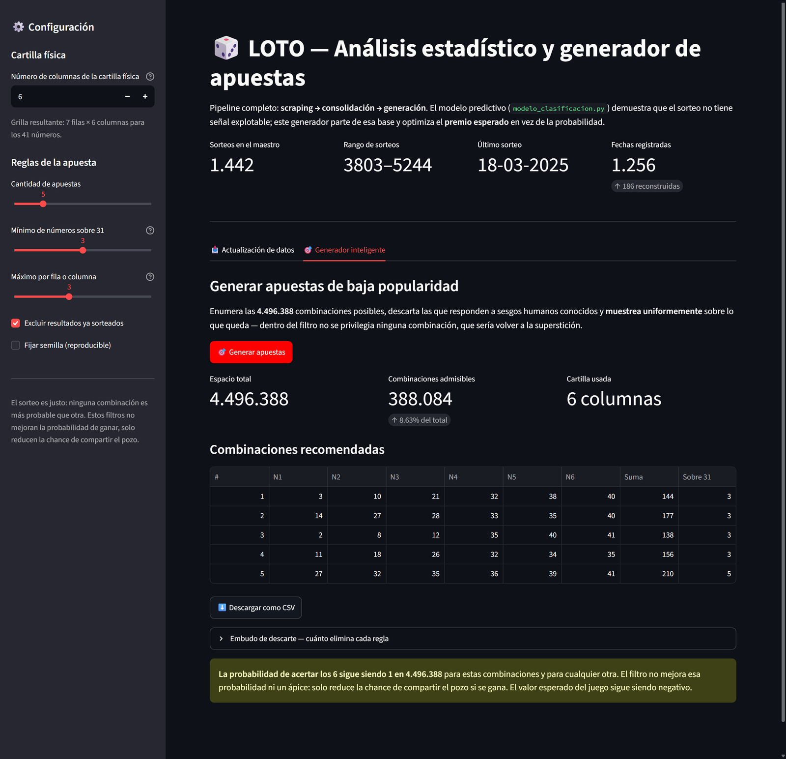
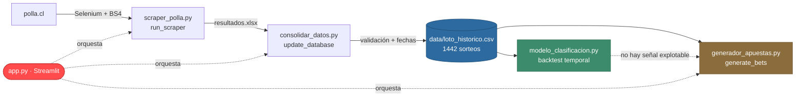
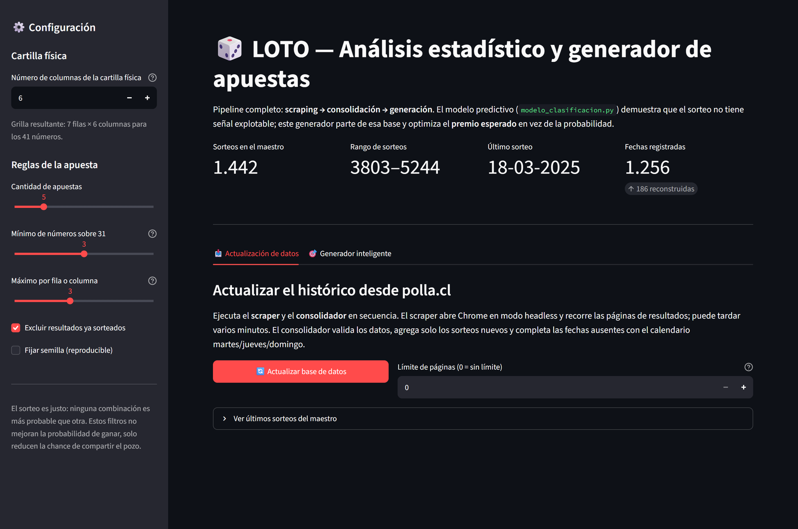

<div align="center">

# 🎲 LOTO — Data Pipeline, Rigor Estadístico y Teoría de Juegos

**Un proyecto que demuestra que la lotería no se puede predecir — y después construye lo único que sí admite optimización.**

[](https://www.python.org/)
[](https://streamlit.io/)
[](https://scikit-learn.org/)
[](https://pandas.pydata.org/)
[](https://www.selenium.dev/)



</div>

---

## 💡 La tesis

La mayoría de los proyectos de "predicción de lotería" fracasan en silencio: construyen un
modelo, reportan un RMSE bajo y nunca notan que la métrica medía otra cosa. Este proyecto
hace lo contrario — **usa el rigor estadístico para demostrar la ausencia de señal**, y solo
entonces construye algo útil sobre esa base.

<table>
<tr>
<td width="50%" valign="top">

### 🔬 Parte 1 · ¿Se puede predecir?

**No, y se demuestra.**

Backtest con split temporal estricto, verificación
programática contra *data leakage* y métricas
calibradas.

**Resultado:** ROC AUC = 0.4926, y un log loss
*peor* que predecir la constante 6/41.

`modelo_clasificacion.py`

</td>
<td width="50%" valign="top">

### 🎯 Parte 2 · ¿Qué sí se optimiza?

**El premio, no la probabilidad.**

El pozo se reparte entre los ganadores. Jugar
combinaciones impopulares no cambia la chance de
ganar, pero sí cuánto se cobra si se gana.

**Resultado:** 388.084 combinaciones admisibles
de 4.496.388, por enumeración exhaustiva.

`generador_apuestas.py`

</td>
</tr>
</table>

> El valor de este repositorio no está en un modelo con buenas métricas, sino en la
> **metodología para no engañarse**. Sobre estos datos, un backtest mal construido produce
> con facilidad resultados que parecen señal y no lo son.

---

## 📑 Contenido

- [Arquitectura](#-arquitectura)
- [Instalación y uso](#-instalación-y-uso)
- [Ingeniería de datos](#-ingeniería-de-datos)
- [Parte 1 — Demostrar la ausencia de señal](#-parte-1-demostrar-la-ausencia-de-señal)
- [Parte 2 — Optimización por teoría de juegos](#-parte-2-optimización-por-teoría-de-juegos)
- [Decisiones técnicas destacadas](#-decisiones-técnicas-destacadas)
- [Advertencia](#-advertencia)

---

## 🏗 Arquitectura



Cada módulo expone su lógica como **función importable**, de modo que la interfaz los importa
directamente en vez de invocar subprocesos: los errores suben como excepciones y llegan a la
GUI con su traza real, en vez de perderse en el código de salida de un `os.system`.

| Archivo | Rol | API principal |
|---|---|---|
| `app.py` | Interfaz Streamlit y orquestador | — |
| `scraper_polla.py` | Scraping de polla.cl, con modo web en vivo (SSE) | `run_scraper()` |
| `consolidar_datos.py` | Validación, merge incremental y fechas | `update_database()` |
| `modelo_clasificacion.py` | Backtest temporal y prueba de ausencia de señal | `main()` |
| `generador_apuestas.py` | Optimización combinatoria | `generate_bets(columnas=6)` |
| `data/loto_historico.csv` | Fuente única de verdad · 1442 sorteos (3803–5244) | — |

---

## 🚀 Instalación y uso

```bash
git clone https://github.com/HangLoose84/loto-data-pipeline.git
cd loto-data-pipeline
pip install -r requirements.txt
streamlit run app.py
```

La interfaz tiene una barra lateral donde se configura **el número de columnas de la cartilla
física** — las reglas visuales dependen de esa grilla — y dos paneles:

| Panel | Qué hace |
|---|---|
| 📥 **Actualización de datos** | Ejecuta scraper y consolidador en secuencia, con avance en vivo, y muestra las estadísticas del maestro resultante |
| 🎯 **Generador inteligente** | Aplica los filtros con la cartilla configurada y entrega las combinaciones en tabla, descargables como CSV |

<details>
<summary><b>Ver el panel de actualización de datos</b></summary>



</details>

Cada módulo funciona también por línea de comandos:

```bash
python modelo_clasificacion.py --test 400 --refit 25
python generador_apuestas.py -n 5 --columnas 6 --altos 3
python consolidar_datos.py resultados.xlsx
```

---

## 🧹 Ingeniería de datos

El dataset maestro se consolidó a partir de tres fuentes solapadas. La fusión se validó
**antes** de descartar los originales: cero discrepancias en los 1256 sorteos comunes.

### Reconstrucción de fechas ausentes

186 sorteos llegaron sin fecha. El sorteo se realiza **martes, jueves y domingo**, y sobre los
1256 registros con fecha la correspondencia `sorteo N ↔ N-ésimo día de sorteo` resultó ser una
**biyección exacta**: los 1256 días del rango están todos ocupados, sin huecos ni duplicados,
sin una sola excepción en 8 años. Los 6 sorteos que parecían anómalos son los especiales de
Nochebuena y Año Nuevo, que solo cambian de hora.

> **Validación fuera de muestra.** Anclando el calendario en el sorteo 5214 (2025-01-07),
> predice correctamente las fechas de 8 sorteos scrapeados en vivo **250 sorteos más allá del
> ancla** (5457–5464, julio–agosto 2026): **8 de 8 exactas**.

La columna `fecha_origen` conserva la trazabilidad, porque no todas las fechas merecen la
misma confianza:

| `fecha_origen` | Sorteos | Confianza |
|---|---|---|
| `registrada` | 1256 | Fecha original de la fuente |
| `reconstruida` | 186 | Derivada del calendario |

De las reconstruidas, 30 están confirmadas por el ancla externa. Las otras 156 (año 2016)
extrapolan hacia atrás y **no tienen validación independiente**: si Polla usó otro calendario
en 2016, esas fechas estarían corridas. Los números de esos sorteos no están en duda, solo
sus fechas.

<details>
<summary><b>Defectos del scraper original que la refactorización corrigió</b></summary>

- **Filas basura.** No se validaba nada, así que encabezados de tabla y sorteos sin publicar
  entraban como filas de vacíos: el `.xlsx` original tenía 11.540 filas para 1.442 sorteos.
- **Duplicación sistemática.** Si el clic en "Siguiente página" no alcanzaba a cargar, se
  releía la misma tabla — cada sorteo aparecía exactamente dos veces.
- **Fecha descartada.** El sitio publica la fecha y el scraper la tiraba, forzando a
  reconstruirla. Ahora se captura directamente.

La lógica de parseo quedó aislada en `parsear_fila()`, una función pura testeable sin red.

</details>

---

## 🔬 Parte 1 — Demostrar la ausencia de señal

### El error que había que corregir

El enfoque ingenuo predice `Numero ganador 3` como variable continua a partir de la fecha.
Está roto de raíz: **esa columna no es un fenómeno físico, es el resultado de ordenar los 6
números**. El modelo aprende la estadística de orden — la posición 3 tiende a ~18 — baja el
RMSE y aparenta funcionar sin haber aprendido nada del sorteo.

### La reformulación correcta

| Decisión | Por qué |
|---|---|
| **Multi-etiqueta** | Una fila por (sorteo, número), etiqueta binaria "salió / no salió". Un clasificador estima `P(k)` para los 41 números y los rankea |
| **Split temporal estricto** | Entrena con sorteos ≤ N y predice el N+1, con reajuste periódico y ventana expansiva |
| **Features causales** | Frecuencias en ventanas de 10/25/50/100/250 sorteos, frecuencia histórica, sorteos desde la última aparición, día de semana y mes |
| **Métrica real** | Aciertos sobre 6, contra la hipergeométrica que describe el azar |

### 🛡 Prueba de perturbación contra data leakage

Afirmar "no hay leakage" no basta. La construcción de features se verifica
programáticamente: se **altera por completo el sorteo _t_** y se comprueba que `X[:t+1]` quede
**bit a bit idéntico**, y que `X[t+1:]` sí cambie — confirmando que las features usan el
pasado, y solo el pasado. Sin esa prueba, cualquier resultado positivo sería indistinguible de
una fuga temporal.

### 📊 Resultados — backtest sobre los últimos 400 sorteos

| Estrategia | Aciertos /6 | z | p | Veredicto |
|---|---:|---:|---:|---|
| Modelo (HistGradientBoosting) | 0.8300 | −1.19 | 0.235 | Indistinguible del azar |
| Azar puro | 0.9125 | +0.85 | 0.395 | — |
| Los más frecuentes ("calientes") | 0.8450 | −0.82 | 0.414 | Indistinguible del azar |
| Los más atrasados ("fríos") | 0.8975 | +0.48 | 0.631 | Indistinguible del azar |
| **Esperanza teórica del azar** | **0.8780** | | | |

Lo más concluyente no es esa tabla, sino la **calibración de las probabilidades**:

| Métrica | Valor | Lectura |
|---|---|---|
| ROC AUC | **0.4926** | Sin información (0.5 = moneda al aire) |
| Log loss del modelo | **0.4166** | — |
| Log loss de la constante 6/41 | **0.4163** | El modelo es medible y literalmente **peor que no modelar** |
| Rango de `P(k)` | 0.1135 – 0.2400 | Se dispersan alrededor del 0.1463 teórico: **ruido puro** |

Esa dispersión es exactamente el aspecto que tiene un modelo sobreajustando a un proceso
aleatorio. Un chi-cuadrado sobre los 1442 sorteos da **p = 0.92**: los 41 números son
estadísticamente indistinguibles de uniformes. El sorteo es limpio, y el modelo lo confirma
desde el lado predictivo.

---

## 🎯 Parte 2 — Optimización por teoría de juegos

Si toda combinación es igual de probable, la pregunta deja de ser *cuál sale* y pasa a ser
**con cuánta gente hay que repartir el pozo si sale**. Eso es teoría de juegos, no predicción:
se optimiza contra el comportamiento de los otros apostadores, no contra el sorteo.

### Reglas y el sesgo humano que explota cada una

| Regla | Sesgo |
|---|---|
| ≥3 números sobre 31 | Fechas de nacimiento concentran el juego en 1–31, sobre todo en 1–12 |
| Sin 3+ enteros consecutivos | `1-2-3-4-5-6` y variantes |
| Sin progresión aritmética de 4+ términos | Patrones regulares de cualquier paso |
| Sin 3+ términos en paso redondo (5, 10) | `10-20-30-40` |
| Ni todos pares ni todos impares | Combinaciones "estéticas" |
| Repartido en 3+ decenas | Bloques concentrados |
| Máx. N por fila y por columna | Líneas y columnas rellenadas a mano |
| Ocupa 3+ filas y 3+ columnas | Cruces, diagonales, bordes, esquinas |
| No repite un resultado histórico | Mucha gente juega combinaciones ya sorteadas |

### Enumeración exhaustiva, no muestreo

El espacio **C(41,6) = 4.496.388** se recorre completo, así que los porcentajes de descarte
son **exactos**. Con la cartilla por defecto sobreviven **388.084 combinaciones (8.63%)**.
La selección final es un **muestreo uniforme** sobre ese conjunto: privilegiar algo dentro del
filtro sería reintroducir la superstición por la puerta de atrás.

### Cartilla parametrizable

Las reglas visuales dependen de la grilla del cartón físico, configurable desde la interfaz:

| Columnas | Grilla | Admisibles | % del total |
|---:|---|---:|---:|
| 5 | 9 × 5 | 379.322 | 8.44% |
| **6** (defecto) | **7 × 6** | **388.084** | **8.63%** |
| 7 | 6 × 7 | 383.388 | 8.53% |
| 10 | 5 × 10 | 356.648 | 7.93% |

---

## ⚙️ Decisiones técnicas destacadas

<details open>
<summary><b>Máscaras de bits: de 45 s a 3 s</b></summary>

Cada combinación se representa además como una **máscara de 41 bits**, lo que convierte
"¿está presente el número *v*?" en un desplazamiento sobre un vector de enteros. Buscar
progresiones aritméticas sobre 4,5 millones de combinaciones pasó de ~36 s a menos de 1 s, y
el filtrado completo de ~45 s a ~3 s por configuración, con el precálculo cacheado entre
llamadas. **El rewrite reproduce el conteo exacto de cada regla**, verificado como regresión.

</details>

<details>
<summary><b>Validación antes de destruir</b></summary>

La consolidación de las tres fuentes originales no se dio por buena: se verificó que el CSV
maestro contuviera cada fila de cada fuente, con sus fechas intactas, **antes** de eliminar
los archivos originales. Cero discrepancias en 1256 sorteos solapados.

</details>

<details>
<summary><b>Pruebas donde importan</b></summary>

- `parsear_fila()` se testea contra los strings exactos del DOM real, incluyendo encabezados,
  sorteos sin publicar y números fuera de rango.
- Las reglas del generador se testean contra patrones concretos: `1,2,3,4,5,6`,
  `5,10,15,20,25,30`, todos pares, y una columna completa de la cartilla.
- Las features del modelo se testean por perturbación causal.

</details>

---

## ⚠️ Advertencia

> **La probabilidad de acertar los 6 es 1 en 4.496.388** para las combinaciones que genera
> esta herramienta y para cualquier otra. Los filtros **no mejoran esa probabilidad ni un
> ápice**: solo reducen la chance de compartir el pozo si se gana. El valor esperado del juego
> sigue siendo negativo.
>
> Este proyecto es un ejercicio de estadística, ingeniería de datos y teoría de juegos —
> no una estrategia para ganar dinero.

---

<div align="center">

`Python 3.12` · `pandas` · `numpy` · `scipy` · `scikit-learn` · `Streamlit` · `Selenium` · `BeautifulSoup` · `Flask`

</div>
